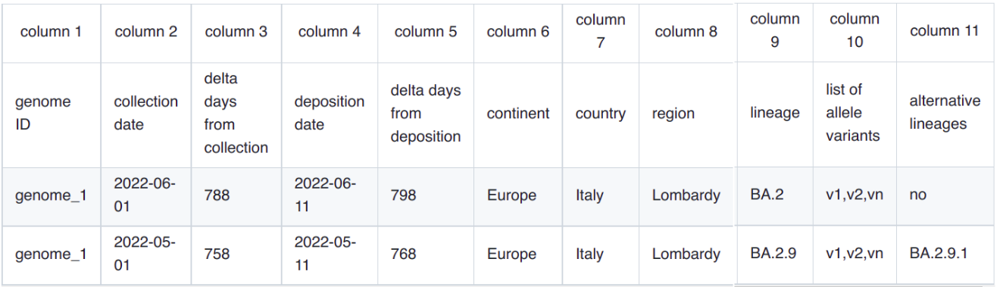

6 Assign genomes to new groups
===============================

*assign.pl* an efficient and quick method that can assign SARS-CoV-2 genomes to any nomenclature of choice; including, but not limited to, the "expanded" nomenclature derived by augmentClusters.pl. 
The utility applies a simple algorithm based on phenetic distances (described in Chiara et al 2021). For every group, users need to provide a list of "characteristic" allele variants, here defined as those present in more than 50% of the genomes that form the group.
For every isolate in the input file, distances to all the groups/lineages/variants in the nomenclature are computed, and finally the genome is assigned to the group with the highest similarity. In case of multiple groups/classes/lineages with identical similarity levels, the most ancestral lineage/group/class is selected. 

*assign.pl* takes 2 main input files: 1 a simple file with "group/lineage/variang" defining genomic variants; 2 a metadata table, in HaploCoV format. See linDefMut in the current github repository for an example of a file with lineage defining variants (or the Genomic variants file section). 
The output is in HaploCoV format.

**Assigning Pango Lineages** 
The file*linDefMut* in the current github repository provides a complete list of defining genomic variants for all the lineages included in the Pango nomenclature. Feel free to use that file if you need to assign genomes/isolates according to Pango. The file is updated on a bi-weekly basis.

**Assigning Haplogroups as defined in Chiara et al 2021**
*HaploDefMut* in the current github repository provides a complete list of defining allele variants for all haplogroups identified by the method described in Chiara el al 2021. Feel free to use that file if you need to assign genomes according to that system. The file is updated on a bi-weekly basis.

**Options**
*assign.pl* takes the following options:

* *---dfile*: input file list of SARS-CoV-2 lineages/sub lineages along with characteristic mutations
* *--metafile*: a metdata file in HaploCov format
* *--out*: the name of the ouput file (defaults to **ASSIGNED_out.tsv**)

**Execution**
To assign genomes to a lineages/group/classes you need to run

::

 assign.pl  --dfile linDefMut50  --metafile  linearDataSorted.txt --out  linearDataSorted.txt_reAssigned
 
The output consists of a table in HaploCoV format, similarly to the input. The group/class/lineage assigned to each genome (9th column) will be updated with the newly assigned groups/class/lineages. Moreover an additional column will be added to indicate/report alternative assignments with equal levels of similarity. An example is outlined below. *No* indicates no alternative assignments were idenfied, and hence that the genome was unambiguously assigned to a single group/lineage.

**Execution times, and multithreading** 

Using a single core/thread *assign.pl* can assign the complete collection of more than 15M of genomes included in GISAID to pango lineages in about 4 hours. The companion utility *p_assign.pl* included in this repository can be used to parallelize the execution of *assign.pl* if required (see below). Execution times are reduced linearly. For example, if 24 cores are used, less than ten minutes are required to assign 11M genomes.

**p_assign.pl**

Multi-threading, the p_assign.pl utility included in this repo provides means to execute assign.pl on multiple threads/cores/processors.
The following input parameters are accepted:

* *---dfile*: input file list of SARS-CoV-2 lineages/sub lineages along with characteristic mutations
* *--metafile*: a metdata file in HaploCov format
* *--out*: the name of the output file (defaults to **ASSIGNED_out.tsv**)
* *--nproc*: number of processors/cores

To execute it you can use:

::

 p_assign.pl  --dfile linDefMut50  --metafile  linearDataSorted.txt --nproc 8 --out  linearDataSorted.txt_reAssigned

Input files are the same as those provided to *assign.pl*. Output format is in the same format described above.

.. warning::
Since *p_assign.pl* does directly make use of *assign.pl* when it is executed, both scripts need to be in the same folder when invoking *p_assign.pl*. Execution will halt and raise an error is *assign.pl* is not found/is not in the same folder as *p_assign.pl*. 

All input files **MUST** be in the **same folder** from which the program is executed. 
