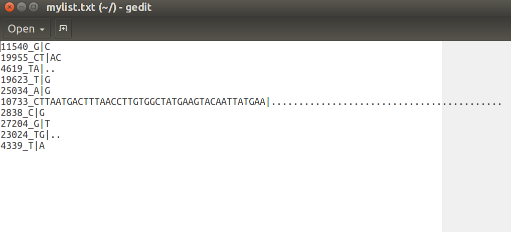

Executing custom analyses: custom alleles set
=============================================

Although HaploCoV was originally devised to use a predefined set of high frequency alleles (derived by computeAF.pl) to search for novel clusters of viral genomes, in principle **any custom files** with a list of allele variants of interest can be used for this task. This approach allows the identification of clusters/novel potential designations defined by any combination of allelic variants of interest.  

To execute custom analysis and identify potential new lineages/viral clusters defined by any arbitrary set of allelic variants, all you need to do is to provide a "custom" posFile with the (--posFile) option to augmentCluster.pl . This file has a very simple format: allelic variants are listed one per line. This is a minimal (viable) example:

Allelic variants of interest do not need to be in any specific order. All you need to do is to comply with the format used by HaploCoV. Allele variant should be indicated according to the following rules:

::

 <genomic-position>_<reference-allele>|<alternative-allele>

and always with respect to the reference Refseq assembly of the SARS-CoV-2 genome (refseq ID NC_045512 or see above: Running HaploCoV-> reference genome). 
For example a C to T nucleotide substitution in position 241, should be indicated as:

::
 
 241_C|T

Precomputed sets of allelic variants
====================================

The main repository of HaploCoV incorporates precomputed sets of allelic variants which can be used to identify novel potential groups of SARS-CoV-2 genomic sequences with different features.

These precomputed sets of alleles can broadly be categorized into 3 main classes:

1. *Highly variable genomes.* These are allelic variants found in at least 25 "highly divergent" genomic sequences, at not-overlapping intervals of time of 60 days.  Highly divergent/variable genomes are defined as those carrying at least 6 or more allele variants that are not characteristic to their assigned lineage. Intervals are non-overlapping windows of 60 days, starting from Mon 12-30-2019.  Dates are expressed in "HaploCoV format", i.e offsets from the start date 2019-12-30. For example the file: *900_960_list.txt* contains allelic variants identified in at least 25 distinct highly variable genomes between day 900 and day 960. These files are stored under the folder: **HighVar**

2. *Country specific allele variants.* Allele variants reaching a frequency of 1% or higher, for at least 15 days  in a country at any time point from Mon 2019-12-30.  These files are stored under the folder: **country**. Each file is named  after the corresponding country. *Thailand_list.txt* reports the list of high frequency allelic variants observed in Thailand

3. *Increased frequency alleles.* Allelic variants showing an increase in their prevalence of a 1.5 fold or greater in at least one country, at different months, and starting from January 2020.  These files are stored under the folder: **HighFreq**. Each file is named according to the corresponding month: *April2021_list.txt* reports allele that increased in prevalence in April 2021  

All our collections of allelic variants are updated on a weekly basis. Tipically every Wednesday. All files are downloaded automatically at every new installation of HaploCoV. Specific files of interest can be downloaded when/if needed. For example, under unix systems by using the `wget` utility. Some examples are reported below:

1. HyperVariable:

::

 wget https://raw.githubusercontent.com/matteo14c/HaploCoV/master/alleleVariantsSet/HighVar/900_960_list.txt` 

2. Country:

::
 
 wget https://raw.githubusercontent.com/matteo14c/HaploCoV/master/country/alleleVariantsSet/country/Thailand_list.txt 

3. High-freq:

::

 wget https://raw.githubusercontent.com/matteo14c/HaploCoV/HighFreq/master/alleleVariantsSet/HighFreq/April2021_list.txt

Possible applications. #1 identifying \<hyper-variable> clusters of genome sequences
====================================================================================

Suppose that we want to identify groups/cluster of genome sequences that carry an excess of allelic variants with respect to their assigned lineage. Recent experience suggests that VOC variants of SARS-CoV-2 are characterised by a significantly increased number of allelic variants compared with their ancestors. This is particularly true for Omicron, but it does also apply to other VOCs.  
As recently summarized by Markov et al in their review, antigenic drift might represent a major driving force for the evolution of SARS-CoV-2, and hence the next new VOC-VOI-VUM like variants might be characterised/defined by the accumulation of a large number of novel non-synonymous alleles.
*Markov PV, Katzourakis A, Stilianakis NI. Antigenic evolution will lead to new SARS-CoV-2 variants with unpredictable severity. Nat Rev Microbiol. 2022;20(5):251-252. doi:10.1038/s41579-022-00722-z*

To identify "highly-variable" clusters of viral genomes in HaploCoV you can use augmentClusters.pl together with any of the sets of allelic variants available under the alleleVariantsSets/HighVar folder. Please notice however that each file in HighVar corresponds with a pre-defined interval of time. Hence is advised that only genomes isolated within a time-frame compatible with that indicated by the file should be included in your analyses. 
For example if you want to analyse/identify highly variable clusters of genome sequences between genomes collected between days 840 and 900 (2022-05-01 and 2022-06-30) you will need to:
1. subset your input file in HaploCoV format accordingly
2. use augmentClusters.pl + *840_900_list.txt*
3. apply the "standard" HaploCoV workflow afterwards

This would roughly translate into the following commands:

::

 cut -f 2 HaploCoVformattedData.txt | grep -n "2022-04-30" |head -n 1 # Find the first occurence of the end date

::

 cut -f 2 HaploCoVformattedData.txt | grep -n "2022-06-30" |tail -n 1 # Find the last occurence of the start date

and then 

::

 head -n XXXXXX HaploCoVformattedData.txt | tail -n YYYYYY > myIntervalOfTime` #Extract the data, see above

where XXXXXX and YYYYYY are actually the line numbers of the slice of the file you need. Please see above for how to derive these numbers from the output of `cut` + `grep` + `head`/`tail`
 
or alternatively, with **subset.pl**:

::
 
 perl subset.pl -infile HaploCoVformattedData.txt --startD 2022-05-01  --endD 2022-06-30 --outfile myIntervalOfTime

Once you have a file with only the data on interest -*myIntervalOfTime* in this case- you can simply run augmentClusters.pl. If you want to identify groups of highly variable sequences, you can set the --size and --dist parameters accordingly (see above for more details).

In this example I will be searching for groups supported by at least 5 distinct genomic (--size 5) sequences, and carrying at least 6 additional allelic variants with respect to the assigned lineage/designation (--dist 6). However --size and --dist can be increased or decreased according to your needs.

::

 perl augmentClusters.pl --metafile myIntervalOfTime --posFile 840_900_list.txt --dist 6 --size 5 --outfile highlyVariableGroups

at this point you can use LinToFeats.pl and report.pl to identify novel designations showing an increase in their HaploCoV score:

::

 perl LinToFeats.pl --infile  highlyVariableGroups --outfile  highlyVariableGroups_feats.tsv

::

 perl report.pl --infile highlyVariableGroups_feats.tsv --outfile highlyVariableGroups_prioritization.txt

The file highlyVariableGroups_prioritization.txt will report the novel designations with a significant increase in their HaploCoV score. If-any, these novel designations should be probably added to the reference nomenclature.

Possible applications. #2 Analysing data from a specific country
================================================================

If you want to analyse data from only a specific country, this can be easily done by using allele variants files found under the alleleVariants/country folder. Again you will need to subset your HaploCoV formatted data accordingly, and retain only data from the country of interest. 
This should be relatively easy. If for example we want to analyse only data from Thailand we can use the following commands:

::

 grep -P "\tThailand\t" HaploCoVformattedData.txt > ThaiData #extract data from Thailand 
 
 or

:: 
 
 perl subset.pl --infile HaploCoVformattedData.txt --country Thailand --outfile ThaiData

And then

::
 
 perl augmentClusters.pl --metafile ThaiData --posFile Thailand_list.txt --outfile ThaiClusters.txt

At this point we can resume the "standard" workflow of HaploCoV, and apply LinToFeats.pl and report.pl :

::

 perl LinToFeats.pl --infile  ThaiClusters.txt --outfile  ThaiClusters_feats.tsv

::

 perl report.pl --infile ThaiClusters_feats.tsv --outfile ThaiClusters_prioritization.txt

Possible applications. #3 Can I combine #1 and #2? 
=====================================================

Yes of course! You can apply all of the above to any type of selection. For example:
 
 1. use highly variable alleles, but limited to data from a specific country
 2. use highly variable alleles, but limited to data from a specific lineage
 3. use country-specific alleles on a specific lineage and only in any interval of time of your interest
 
By using subset.pl or/and the commands outlined above it should be easy to subset the data and then apply augmentClusters.pl in any way that suites your needs.
And obviously in case of doubts/questions and or need for additional files that are not included in HaploCoV you can always drop me a mail or alternatively open an issue here on Github
 
**Regards, from the HaploCoV development "team"**
