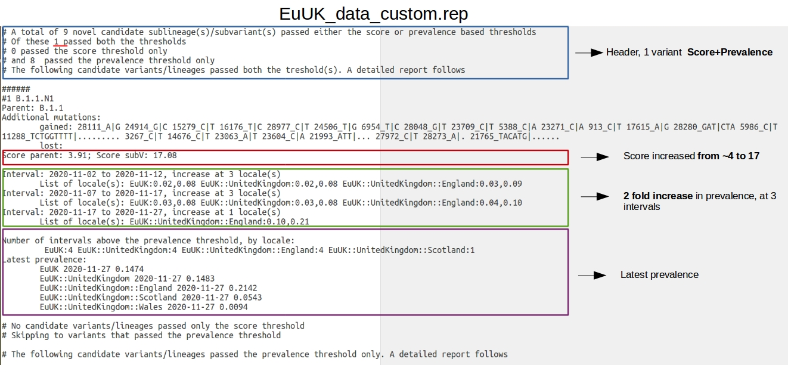
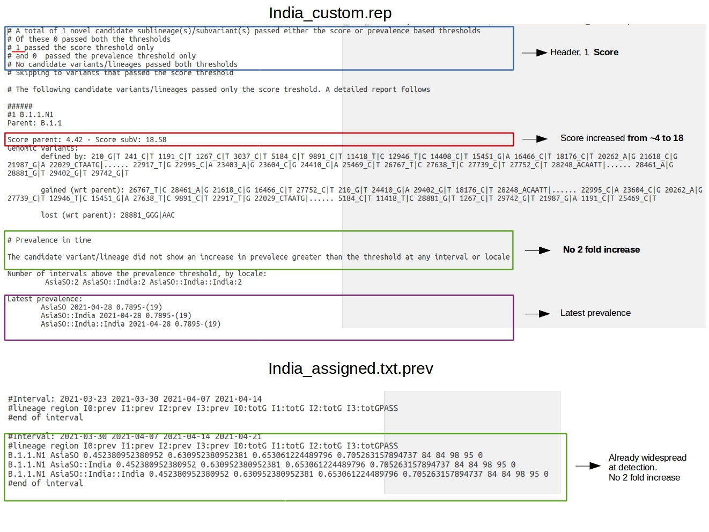
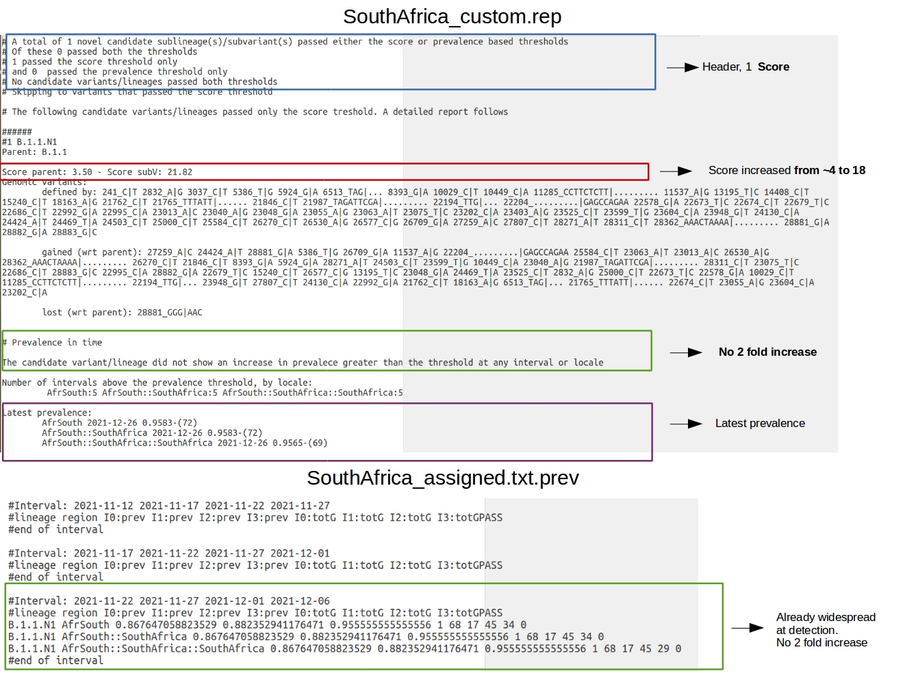

Use Cases
=========

The folder *useCases* in the main repository provides a collection of files and examples that can be used to test HaploCoV for the identification of novel variants of SARS-CoV-2. Three use cases are provided, all associated with emergence of a VOC:

1. Alpha in the UK;
2. Delta in India;
3. Omicron in South Africa.

For every use case only genomic sequences collected within an interval compatible with the emergence of each VOC, and from the country where each VOC was first reported, were extracted from the complete dataset of publicly available SARS-CoV-2 genome sequence (Nexstrain data). Subsequently, all the genomes assigned to VOC-related lineages were manually re-assigned to the **B.1.1** lineage. Finally, *HaploCoV* was applied to verify if VOC lineages could be re-intified from scratch.
Users are kindly invited to re-run/re-proccess these data to test the main functionalities of HaploCoV.

Please notice that since publicy avaliable data include only about 36% of the complete collection of genomic sequences available in GISAID, default parameters were adjusted to cope with the reduced number of sequences. In particular the number of supporting genomic sequences required to form a designation was lowered to 25 (parameters file paramVOC).

Use case 1. Alpha
=================

The file *alphaNX* contains a complete collection of the genomic sequences of SARS-CoV-2 specimens isolated in the United Kindgom between 2020-09-01 and 2020-11-15. The total number is 36820.
The following HaploCoV command was be used to process the file and derive novel variants:

::

 perl HaploCov.pl --file alphaNX --locales alpha.loc --param paramVOC

The locales file *alpha.loc* restricts the scope of the analysis to the United Kingdom (area=EuUK) and to sequences collected inbetween 2020-09-01 and 2020-11-15.
The final output of HaploCoV is written to the report file *EuUK_custom.rep*. Intermediate files will are stored in the folder: *EuUK_custom_results*. 

|

Please take a look to these sections in the manual at readthedocs (and above) for a more comprehensive explanation of these files and what they do: 

* `locales file <https://haplocov.readthedocs.io/en/latest/haplocov.html#configuration-locales-file>`_
* `parameters file <https://haplocov.readthedocs.io/en/latest/haplocov.html#advanced-configuration-parameters-file>`_
* `report file <https://haplocov.readthedocs.io/en/latest/haplocov.html#id5>`_
* `intermediate files <https://haplocov.readthedocs.io/en/latest/haplocov.html#id4>`_

As you can see from the figure below, according to the report: \"5 novel candidate sublineage(s)/subvariant(s) \" were found by HaploCoV, but only 1 did pass both the score and prevalence threshold. This novel candidate lineage, designated as **B.1.1.N1** is defined by 28 additional genomic variants compared to the parental lineage B.1.1, and is associated with an astounding increase in *VOC-ness* score of ~11 points. According to report, **B.1.1.N1** shows an increase in prevalence from 1% (0.01) to 10% (0.1) in between 2020-10-21 and 2020-11-12, in the United Kingdom and in England.
Based on these observations is easy to infer that B.1.1.N1 corresponds with B.1.1.7, the first lineage of the Alpha VOC.

A complete list of the genomic sequences assigned to the novel designation can be retrieved by applying the *subset.pl* tool (see `here <https://haplocov.readthedocs.io/en/latest/subsetting.html#select-a-specific-lineage-hg>`_) to *EuUK_assigned.txt* in the intermediate file folder *EuUK_custom_results* created by HaploCoV while processing the data.
The following command can be issued to select entries assigned to the novel lineage:
::

 perl subset.pl --infile EuUK_custom_results/EuUK_assigned.txt --lineage B.1.1.N1 --outfile novelLin

The output file should include 814 entries.

Use case 2. Delta
=================

*deltaNX* contains a total of 673 genomic sequences of SARS-CoV-2 isolated in the India between 2020-11-01 and 2021-05-01. 
By running: 

::

 perl HaploCov.pl --file deltaNX --locales delta.loc --param paramVOC 

*HaploCoV* is applied to this dataset to derive novel variants; *delta.loc* specifies the country to be analysed (India) and the interval of time (2020-11-01 to 2021-05-01). Results will be written in the report file *India_custom.rep*, intermediate files to *India_custom_results*.

|

According to the output file (screenshot below), only one "interesting" variant was identified by HaploCoV in these settings: **B.1.1.N1**. The novel designation has 34 additional defining genomic variants compared with its parental. The VOC-ness score is increased from 4.42 to 18.58. 
Although the novel designation has a prevalence of almost 80% by 2021-04-28, a 2 fold increase in prevalence is not detected at any time point. 

|

The intermediate file *India_assigned.txt.prev* in the *India_custom_results* folder provides a more detailed picture of the spread of the novel designation (again, see screenshot).
According to this "extended" prevalence report, B.1.1.N1 is first observed at 2021-03-30, and shows a prevalence of ~ 45% by then (see screenshot). Although the prevalence of the variant grows rapidly, the increase is lower that 2 fold at the intervals of time included in the analysis.

This is probably due to the patchy pattern of available data. Indeed we observe that no prevalence is reported for several interval of time in *India_assigned.txt.prev*; this indicates that for several intervals less than 10 genomic sequences were available, 10 being the minimum number of sequences required by HaploCoV to do this computation (see `prevalence report <https://haplocov.readthedocs.io/en/latest/increase.html>`_ in the manual for a more comprehensive explanation). 

Use case 3. Omicron
===================

*omicronNX* includes 1009 genomic sequences of SARS-CoV-2 isolated in the South Africa between 2021-07-01 and 2021-12-31. 
By running: 

::

 perl HaploCov.pl --file omicronNX --locales omicron.loc --param paramVOC

*HaploCoV* can be applied to analyse these data. According to the specfications provided by *omicron.loc* only isolates from South Africa, and in between 2021-07-01 and 2021-12-31 will be analysed.
Main results are saved to *SouthAfrica_custom.rep*. Intermediate files to *SouthAfrica_custom_results*.
Similar to use case 2, only one novel "insteresting" designation is identified by HaploCoV: B.1.1.N1. This novel designation is characterized by 58 genomic variants that are not shared with the parental. The VOC-ness score is increased from 3.50 to 21.82. 

|

According to the prevalence report, B.1.1.N1 has a prevalece above 95% (0.95) in South Africa by 2021-12-26. However B.1.1.N1 is not flagged as an "increased prevalence" variant, since it does not show an increase in prevalence of 2 fold or higher at any interval of time (see screenshot below).

   
The intermediate file *SouthAfrica_assigned.txt.prev* in the *SouthAfrica_custom_results* folder can be used to obtain more information about the prevalence of the newly defined designation.
From the report it is possible to observe that B.1.1.N1 is first identified by HaploCoV at 2021-11-22, and shows a prevalence greater than 86%. Similar to use case 2, also in this case the data are patchy and several intervals of tim have missing data. In this scenario the novel variant is not identified as a variant "showing and increase in prevalence" since it is already dominant/widespread by the time it is first identified.
