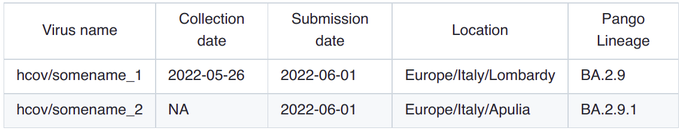

Where do I get the data
=======================

HaploCoV requires 3 main files:

* **the reference assembly** of the SARS-CoV-2 genome in fasta format;
* a **multifasta** file with SARS-CoV-2 genomes to be compared with the reference;
* a **.tsv** file with metadata for the genome sequences in the multifasta;

Reference genome
================
HaploCoV can download the reference assembly of the SARS-CoV-2 genome for you when/if required (see the addToTable.pl utility for more details). However, in the (hopefully) unlikely event that this should not work you can obtain a copy of the reference genome from:
https://ftp.ncbi.nlm.nih.gov/genomes/all/GCF/009/858/895/GCF_009858895.2_ASM985889v3/GCF_009858895.2_ASM985889v3_genomic.fna.gz
on a unix system you can download this file, by

::

 wget https://ftp.ncbi.nlm.nih.gov/genomes/all/GCF/009/858/895/GCF_009858895.2_ASM985889v3/GCF_009858895.2_ASM985889v3_genomic.fna.gz

followed by

::

 gunzip GCF_009858895.2_ASM985889v3_genomic.fna.gz

::

Remember that you need to have this file (GCF_009858895.2_ASM985889v3_genomic.fna) in the same folder from which  HaploCoV is executed (i.e. HaploCoV if you stick with the default)

Input
=====

To run HaploCoV you **need** SARS-CoV-2 genome sequences and associated metadata.

Right now the  `GISAID <https://gisaid.org>`_ database is the most complete and up to date point of access to obtain SARS-CoV-2 data. 
Authorized users can download the complete collection of SARS-CoV-2 genome assemblies and their metadata by following the procedure illustrated in the figure below.

After de-compresson, 2 files should be obtained: 
1. *metadata.tsv* a metadata table in .tsv format and; 
2. *sequences.fasta* a multi-fasta file with SARS-CoV-2 genome sequences.
These files provide the main input to *addToTable.pl*; the utility in HaploCoV that extracts/formats all the data used for subsequent analyses.

Required metadata
=================
Please be aware that some metadata are **mandatory** to execute HaploCoV and that columns names in your metadata file **MUST** abide to the structure/names described below. 

Mandatory metadata:
* a valid unique identifier for every isolate, column name: *"Virus name"*;
* a collection date, column name *"Collection date"*;
* a submission date, column *"Submission date"*;
* location: the geographic place from where the isolated was collected; Column name: *"Location"*;
* a valid lineage/group/class associated with the genome. Column name: *"Pango lineage"* 

Dates must be provided in YYYY-MM-DD format. 
Locations in the following format: Continent/Country/Region. 
Missing information must be indicated by *NA* (not available).
Sequences unique identifiers can not be replaced by *NA* values.

An example of a valid metadata table is reported below

If any of the columns indicated above (names **must be matched exactly**) is not found in your metadata table, execution of HaploCoV will halt and an error message will be raised. 
This does not mean that HaploCoV can process only data from the GISAID database (see below), but only that the metadata that you provide **must have** columns names consistent with those indicated above.

Important: providing "external" data  
====================================

While HaploCoV was designed to work with data from GISAID, the tool can in principle work also with data from other sources, however metadata must always comply with the format described above.
Valid metadata tables must include 5 columns with the following names:
* "Virus name";
* "Collection date";
* "Submission date";
* "Location";
* "Pango Lineage";

Names must match exacly. HaploCoV is case-insensitive.

Important: using data from Nextstrain
=====================================

Users that do not have access to GISAID can obtain the complete collection of publicly available SARS-CoV-2 sequences and associated metadata from Nexstrain, please refer to `here <https://nextstrain.org/sars-cov-2/>`_ for more information.
Metadata in "Nexstrain format" can be obtained from `here <https://data.nextstrain.org/files/ncov/open/metadata.tsv.gz>`_). Since these data have already been processed by Nexstrain using their *ncov workflow*, allele variants are already included in the metadata file and hence **you will not need** to download also the genomic sequences and align them to the reference genome. 
However Nextstrain data, still needs to be converted in "HaploCoV" format.  This can be done by using the *NextStrainToHaploCoV.pl* script included in this repository (see below).
