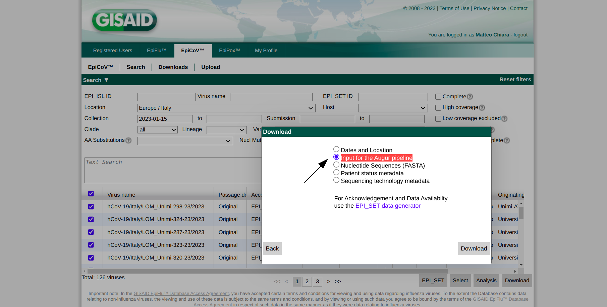

Where do I get the data
=======================

HaploCoV requires 3 input files:

* **the reference assembly** of the SARS-CoV-2 genome in fasta format;
* a **multifasta** file with SARS-CoV-2 genomes to be compared with the reference;
* a **.tsv** file with metadata for the genome sequences in the multifasta.

Reference genome
================
HaploCoV can download the reference assembly of the SARS-CoV-2 genome for you when/if required (see the *addToTable.pl* utility for more details, `here <https://haplocov.readthedocs.io/en/latest/metadata.html#gisaid-data-addtotable-pl>`_). 

However, in the (hopefully) unlikely event that this should not work you can obtain a copy of the reference genome from:

| this `link  <https://ftp.ncbi.nlm.nih.gov/genomes/all/GCF/009/858/895/GCF_009858895.2_ASM985889v3/GCF_009858895.2_ASM985889v3_genomic.fna.gz>`_

on a unix system you can download this file, by:

::

 wget https://ftp.ncbi.nlm.nih.gov/genomes/all/GCF/009/858/895/GCF_009858895.2_ASM985889v3/GCF_009858895.2_ASM985889v3_genomic.fna.gz

followed by:

::

 gunzip GCF_009858895.2_ASM985889v3_genomic.fna.gz

::

Thie file (GCF_009858895.2_ASM985889v3_genomic.fna) is required by several tools in HaploCoV and needs to be in the same folder where our software package was installed (i.e. HaploCoV by default), if this file is missing tools will complain and halt their execution.

Genomes and metadata
====================

GISAID
======

To run HaploCoV you **need** SARS-CoV-2 genome sequences and associated metadata.

Right now the  `GISAID <https://gisaid.org>`_ EpiCoV database is the most complete and up to date point of access to obtain SARS-CoV-2 genomic data and associated metadata. 
Authorized users can download the complete collection of SARS-CoV-2 genome assemblies and their metadata by following the procedure illustrated in the figure below.

.. figure:: _static/fig1.png
   :scale: 80%
   :align: center

After de-compresson, 2 files should be obtained:

1. *metadata.tsv* a metadata table in .tsv format and; 
2. *sequences.fasta* a multi-fasta file with SARS-CoV-2 genome sequences.

These files provide the main input to *addToTable.pl*; the utility in HaploCoV that extracts/formats all the data for subsequent analyses.

GISAID-Augur
============

Users that do not have full to the download of a complete dump of the GISAID EpiCoV database, can use the web interface to download a set of genomes of interest by selecting the corresponding entries. 
HaploCoV is compatible with the input format used by the Augur pipeline, hence users must download their selection of entries in the "Input for the Augur pipeline" format.
See figure below.

The files are normally downloaded in the form of a *.tar* archive. After unpacking a *.fasta* file with the sequences **XXX.sequences.fasta** and a *.tsv* file with metadata **XXX.metadata.tsv** should be obtained. These files can be provided in input to *addToTable.pl*.

Required metadata
=================
Please be aware that some metadata are **mandatory** to execute HaploCoV and that column names in your metadata file **MUST** abide by the structure/names described below. 

Mandatory metadata:

* a valid unique identifier for every isolate, column name: *"Virus name"*;
* a collection date, column name: *"Collection date"*;
* a submission date, column name: *"Submission date"*;
* location: the geographic place from where the isolated was collected, column name: *"Location"*;
* a valid lineage/group/class associated with the genome. Column name: *"Pango lineage"* or *"Lineage"*.

Dates must be provided in *YYYY-MM-DD* format. 
Locations in the following format: *Continent/Country/Region*. 
Missing information must be indicated by *NA* (not available).
Sequence identifiers can not be replaced by *NA* values.

An example of a valid metadata table is reported below.

 .. list-table:: Locales File
   :widths: 50 50 50 50 25
   :header-rows: 1

   * - Heading location
     - Heading qualifier
     - Heading start-date
     - Heading end-date
     - Heading genomic-variants
   * - Italy
     - 2022-11-01
     - 2022-11-11
     - Europe/ Italy /Lombardy
     - BF.1
   * - Thailand
     - 2022-05-11
     - 2022-11-26
     - Asia / Thailand / Buriram
     - BA.5

If your data were obtained from the GISAID EpiCoV database, according to the instructions provided above, all the requirements should be satisfied.
Please notice that however, that if any piece of data/columns indicated above (names **must be matched exactly**) is not found in your metadata table, execution of HaploCoV will halt and an error message will be raised. 
This does not mean that HaploCoV can process only data from the GISAID EpiCoV database, but that is alternative repositories are sued, users must make sure that their metadata **have** column names consistent with those indicated above (see next sections).

Nextstrain
==========

Users that do not have access to GISAID EpiCoV can obtain the complete collection of publicly available SARS-CoV-2 sequences and associated metadata from Nexstrain, please refer to `here <https://nextstrain.org/sars-cov-2/>`_ for more information.
Metadata in "Nexstrain format" can be obtained from `here <https://data.nextstrain.org/files/ncov/open/metadata.tsv.gz>`_. Since these data have already been processed by Nexstrain using their *ncov workflow*, genomic variants are already included in the metadata file and hence **you will not need** to download genomic sequences and align them to the reference genome. 
However, Nextstrain data still needs to be converted in *HaploCoV format*.  This can be done by using *NextStrainToHaploCoV.pl* (see below).

Important: providing "external" data  
====================================

While HaploCoV was designed to work mainly with data from GISAID, the tool can in principle work also with data from other sources, however metadata must always comply with the format described above.
Valid metadata tables must include 5 columns with the following names:

* *"Virus name"*;
* *"Collection date"*;
* *"Submission date"*;
* *"Location"*;
* *"Pango Lineage" or "Lineage"*;

Names must match exactly. 
