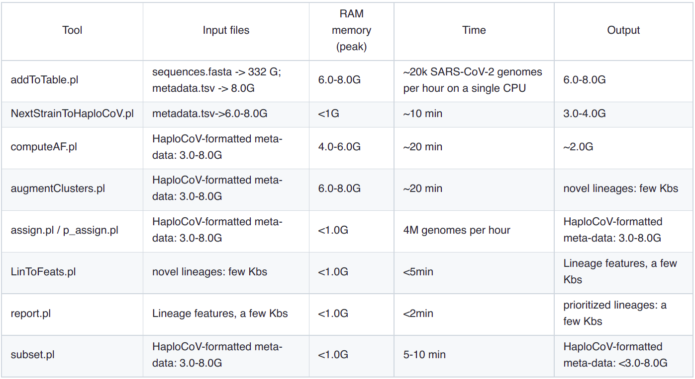

Computational resources
===========================

While the HaploCoV workflow can be executed in reasonable time on a modern, state of the art, laptop please be aware that some of the input files might be extremely large in size. 
For example, the complete fasta file with all SARS-CoV-2 genome sequences avaiable from the GISAID database has a size in the excess of *300 Gb*. While complete metadata files from GISAID are over 8 Gb in size.
Moreover, some tasks/processes can potentially take up to a few days (see for example #6 Assign genomes to new groups) on a single processor. In the light of the above considerations we would kindly invite users to make sure that *they have access* to the required computational resources before executing the HaploCoV workflow. The table below briefly summarizes the requirements in terms of time, RAM memory and disk-space required by eacht tool in HaploCoV. 

If you already have all your metadata in HaploCoV format, executing the full workflow should require less than 2hrs. However execution times might change depending on your computational environment. 
