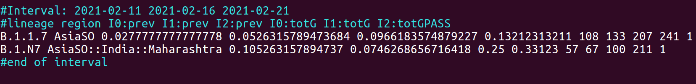

7 Prevalence report
===================

increase.pl is the utility in HaploCoV that enables users to compute the prevalence of SARS-CoV-2 lineages/variants (pre existing or defined by HaploCoV) in space and time, and report lineages/variants that have increased their prevalence. The minimum fold change of increase in prevalence can be set by the user. By default lineages/variants that have doubled their prevalence at al least 1 locale (i.e. fold change of 2 or greater) are reported. 
The tools operates on "time-intervals", that is a number of consecutive units of time. Time units are specified in days and the minimum unit is 1 day.  The size of the units and the number of units to consider can be set at run-time ( by --days and --nInt respectively).
The fold change/change in prevalence is computed by making the ratio between the prevalence at the first time unit in an interval and the last.
The default is to consider 4 distinct (non-overlapping) intervals of 7 days. So by default the tool reports lineages/variants that have doubled their prevalence over the span of 1 month. 

increase.pl requires a metadata table in HaploCoV format as its main input. The report is computed by taking into account all the lineages/variants and geographic entities included in the input file.
The final output consists in a large file, with the complete list of lineages or variants that have increased their prevalence during any time-interval included in input file.

A metadata table in HaploCoV format is the only required input. The full list of parameters includes:

1. *--file* metadata file in HaploCoV format;
2. *--days*  size of time units used to estimate the prevalence, in days. Defaults to 7;
3. *--minFC* minimum fold of increase in prevalence. Fefault=2 fold;
4. *--nInt* number of consecutive time units used to form and interval. Units are specified in days. Default: 4; 
5. *--minP* minimum level of prevalence, variants/lineages below this prevalence are not reported. Default: 0.01;
6. *--minG* minimum number of genome sequences, only lineages associated with --minG or more genomes are reported. Default 5;
7. *--pass* logical value. T=TRUE, F=FALSE. report only variants that fulfilled all the criteria specified by
	--minFc, --minP and --minG. defaults to T (true), if set to F (false) all variants will be reported instead;
8. *--outfile* name of the output file. Defaults to \<\<infile\>\>.prev.

To run the program you MUST provide at least --file. The file needs to be in the current folder.

An example command is provided below:

::

 perl increase.pl --file metadata.tsv

The output will be saved in metadata.tsv.prev
The figure below provides an example of the output. Each interval of introduced by a copuple of header lines, defined by a "#" symbol which reports the start and end of the interval of time and illustrate the format of the report.
The report itself consists in a table with a number of columns that is equal to twice the number of time intervals X 2 plus 3. I.e by default 11.
The first 2 columns report, respectively the name of the lineage and the region where a the increase in prevalence was observed. 
The following columns report the prevalence and each time point in the interval, followed by the total number of genomes used for the computation. The last column (PASS) indicates wheter the lineage fulfilled all the criteria set by --minFc, --minP and --minG (1=TRUE), or not (0=FALSE). This last column is useful only when/if the --pass option is  set F (FALSE). 

   

