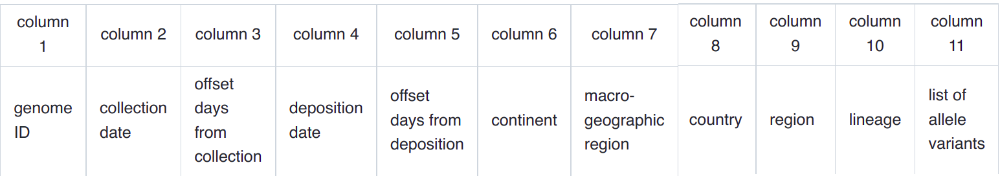

HaploCoV format and input
=========================

All the tools and utilities in HaploCov operate on a large metadata table in tsv format (*HaploCoV* format from here onward). This table contains the required metadata (extracted from "metadata.tsv" or equivalent files) and the collection of allele variants for every SARS-CoV-2 genome included in the analyses.  
If you obtained your data from **GISAID** you can get a metadata table in *Haplocov* format by using the *addToTable.pl* utility. If data were downloaded from Nexstrain, you can use *NextStrainToHaploCov.pl* instead (see below).

HaploCoV format for metadata
============================

An example of the data format used by HaploCoV (HaploCoV format) is reported in the table below:

The file is delineated by tabulations. Allele variants are reported as a comma separated list. 
The format is as follows: 
*genomicposition_ref|alt* i.e. *1_A|T* for example indicates a A to T substitution in position 1 of the reference genome

A valid example of an HaploCoV-formatted file, including all the sequences available in INSDC databases up to 2022-07-20 is available at the following link: `HaploCoVFormatted.txt <http://159.149.160.88/HaploCoVFormatted.txt.gz>`_ in the form o a  with `gzip` compressed file. When de-compressed the file should be around 2.9G in size. 

Dates and time in HaploCoV
==========================

HaploCoV can only read dates in the **YYYY-MM-DD format**. Time periods and intervals of time are computed as offsets, in days with respect to Monday Dec 30th 2019, which in HaploCoV represent day 0. This date represents the beginning of the first week following the first reported isolation of SARS-CoV-2 (December 26th 2019).
For example Tue 31th Dec 2019 is day 1 according to HaploCoV notation and Sun 29th Dec 2019, represents day -1. 

In the HaploCoV metadata format, the 3rd column reports the offset in days between the isolation of a specific isolate and Dec 30th 2019; similarly the 5th column reports the offset from Dec 30th 2019 to the "deposition" of the genome sequence in a public database (typically in GISAID).

Metadata tables in HaploCov format are sorted in descending order by the 3rd column (offset of the collection date). This means that the "most ancient" genome will always be at the top of the file, while the most recently isolated at the bottom.

If you need to know the date of isolation (and offset with respect to day 0) of the most recent genome included in the dataset you can simply use this command in a unix-like shell environment:

::

 tail -n 1 linearDataSorted.txt | cut -f 2,3

For your convenience, the file HaploCoV-dates.csv in this repo reports the conversion to HaploCoV offset format of all the dates from 2019-12-30 to 2025-12-30. Please feel free to refer to that file for dates conversion.

Geography and places
====================

Geography and geography related information are stored in columns 6 to 9 in HaploCoV formatted files. Each column correspond (ideally) to a different level of geographic granularity:
* column 6: continent
* column 7: macro-geographic area
* column 8: country
* column 9: region

Geographic data are inferred directly from your metadata table, by processing the Location column (see above). Locations indicate the place from where isolates of SARS-CoV-2 were retrieved, and must be indicated in the following format:
*Continent / Country/ Region
in your metadata. If "locations" are indicated in a different format, HaploCoV will not be able to process the information and will append NA values in columns 6 to 9.
It is also important to underline that HaploCoV does not perform any correction on the spelling/consistency of geographic data. Hence it is down to the user to provide input data that are as accurate and correct as possible.

1 Importing data
================

GISAID data: addToTable.pl
==========================

addToTable.pl reads multifasta (*sequences.fasta*) and metadata files(*metadata.tsv*) and extracts all the information required for subsequent analyses. A helper script, *align.pl* is used to align sequences to the reference genome assembly of SARS-CoV-2 and derive allele variants.

**Aligning SARS-CoV-2 genomes to the reference**
 
The helper script *aling.pl* is used to derive allele variants by *addToTable.pl*; although you do not need to run it directly, please make sure that you have a copy of align.pl in the same folder from where *addToTable.pl* is executed. Identification of allele variants is performed by means of the MUMMER program. Execution will halt if MUMMER is not installed. Please see above for how to install MUMMER.
All input files *MUST* be in the *same folder* from which the program is executed. 

**Incremental addition of data**

addToTable.pl can add novel data/metadata  incrementally to a pre-existing table in "HaploCoV" format. This feature is extremely useful, since it allows users to add data incrementally to their HaploCoV installation, without the need to re-execute analyses from scratch. To incrementally add data, users just need to provide a non empty output file. **IF** the output file is not empty,  addToTable.pl will process the file and add only those genomes which are not already listed/present in your medatata table. Matching is by sequence identifier (column Virus name).  **Alternatively** the --dayFrom parameter can be used to specify a minimum "start day", and only genomes isolated after that day will be processed and included in the output file. Please refer to the section "Dates and time in HaploCov" to check how dates are handled in HaploCoV

**Options**
addToTable.pl accepts the following options:

* *--metadata**: input metadata file (tipically metadata.tsv from GISAID)
* *--seq*: fasta file
* *--nproc*: number of threads. Defaults to 8.
* *--dayFrom*: include only genomes collected after this day
* *--outfile*: name of the output file

**A typical run of addToTable.pl should look something like:**

::

 perl addToTable.pl --metadata metadata.tsv --seq sequences.fasta --nproc 16 --outfile linearDataSorted.txt 

The final output will consist in a metadata table in HaploCoV format.  This table is required for all the subsequent analyses.

**Execution times** 
Please be aware that typically a single thread/process can align genomes and derive allele variants of about 20k SARS-CoV-2 genomes per hour (160k genomes on 8 cores, or 320k on 16 cores). This would mean that processing the complete collection of the more than 11M genomes included in the GISAID database on June 10th 2022  from scratch will take about 20 days if only one core/process is used. Computation scales linearly, hence 3 days would be needed if 8 processes are used, and 1.5 days if 16 are used. Importantly, since data are added incrementally, this operation needs to be performed only once. 

NextStrain data: NextStrainToHaploCoV.pl
========================================

If you have obtained your metadata files from Nexstrain instead of GISAID you will not need to process the data by addToTable.pl. Metadata tables from Nexstrain have already been processed by their ncov pipeline, and do already include a list of allele variants for every genome. Download is available from `here <https://data.nextstrain.org/files/ncov/open/metadata.tsv.gz>`_. 
Please be aware that however Nexstrain can re-distribute only publicly available data, which at the moment account for about 1/3 of all the data in GISAID.
Data from Nexstrain still need to be converted in *HaploCoV* format. For this purpose you can use the utility *NextStrainToHaploCoV.pl*
Contrary to addToTable.pl, NextStrainToHaploCoV.pl does not feature incremental addition of data: this was not implemented since the full Nexstrain table can be converted in *HaploCoV* format in 3 to 5 minutes. 

**Options**
NextStrainToHaploCoV.pl accepts the following options
--*metadata*: name of the input file
--*outfile*: name of the output file

**Execution**

A typical command line for NextStrainToHaploCoV.pl is something like:

::

 NextStrainToHaploCoV.pl --infile metadata.tsv --outfile linearDataSorted.txt

The output file will be in *HaploCoV* format and can be used by computeAF.pl to compute allele frequencies 
