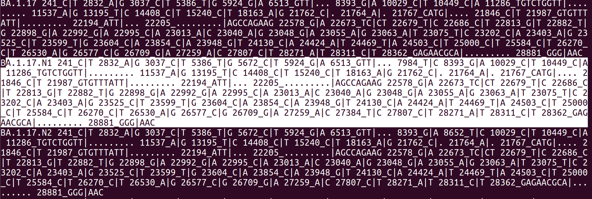

3 Derive novel groups
=====================

Novel groups/sublineages of SARS-CoV-2 are identified by *augmentClusters.pl*. This utility is used to derive novel sub-groups/sub lineages within an existing classification of SARS-CoV-2 lineages/variants. The aim is to extend a "target" classification by the incoporation of local/regional high genomic variants, which are used to infer/derive local variants of the virus. Users can specify the minimum size (minimum number of isolates included in the group) required for a novel group to be formed (*--size*) and the minimum distance (in terms of number of characteristic high frequency alleles, *--dist*) between newly formed and extant groups.
The input is the metadata table in **HaploCoV** format. The output will consist of a simple text file including a list of SARS-CoV-2 variants/lineages (one per line) and the list of their characteristic (present in >50% of the genomes) genomic variants. The file will include all the extant lineages/variants specified in the metadata table,  and also novel variants/lineages formed by the tool. All novel variants/lineages will be indicated by a suffix (*--suffix*) that can be specified by the user.

**High frequencies alleles for Nexstrain data**

Collections of high frequency alleles available from the HaploCoV Github repository are derived from the periodic processing of the complete collection of SARs-CoV-2 genomes included in the GISAID database; and hence should provide a more comprehensive representation of high frequency alleles than that which could be obtained by processing publicly available data re-distributed by Nexstrain with computeAF.pl. In the light of these considerations, users that have access only to Nextstrain data are kindlly *encouraged* to take adavantage (and use) high frequency allele files that are available from this repository instead of using "computeAF.pl" on their data.
Please see above for how to download the most recent version of any of those files.

**Options**

augmentClusters.pl accepts the following parameters:

* *--metafile* name of the metadata file (please see above the section above concerning the format/mandatory information)
* *--posFile* list of high frequency alleles (this is one of the main outputs of computeAF.pl, typically areas_list.txt)
* *--dist* minimum edit distance (number of characteristic high frequency alleles) required for forming a novel group. Defaults to 2
* *--suffix* suffix used to delineate novel lineages,defaults to N
* *--size* minimum size for a new subgroup within a lineage/group, defaults to 100
* *--tmpdir* directory used to store temporary files
* *--oufile* name of the output file
The main output will be saved in the current folder. 

**Execution**
A command line for *augmentClusters.pl* should look something like:

:: 

perl augmentClusters.pl --outfile lvar.txt --metafile linearDataSorted.txt  --posFile areas_list.txt

The main output file, lvar.txt will contain all current groups/lineages and newly formed groups/sub-lineages, and a complete list of their defining mutations, in txt format one per line. An example is outlined in the screenshot below.

**Novel variants identified by HaploCoV**

Novel variants identified by HaploCoV will be reported in the output file produced by *augmentClusters.pl*. The format of this file is very simple: every line reports a lineage/group, defined by the corresponding id/name, followed by the list of characteristic genomic variants (defined here as those present in >50% of the isolates assigned to the group). Values are separated by spaces (see above).
This file includes the complete collection of lineages/groups as defined in the reference input nomenclature, plus all the novel lineages/groups/sub-lineages formed by HaploCoV. Newly formed lineages/groups/sub-lineages are identified by a suffix that can be specified by the user and by a progressive number. The default value for this suffix is the letter **"N"**. If for example two novel lineages/groups/sub-lineages are derived in the Pango BA.1.17 lineage, these will be reported as:
1. BA.1.17.N1 and;
2. BA.1.17.N2;
in the output file (see above).
