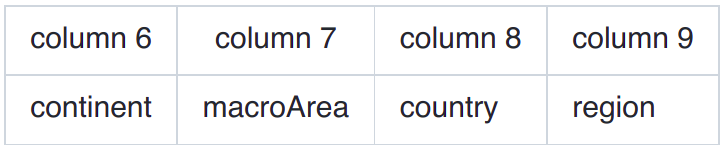
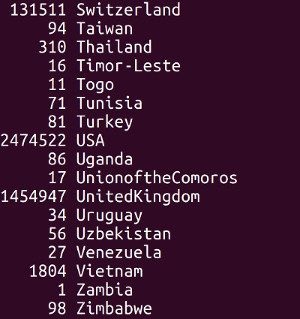
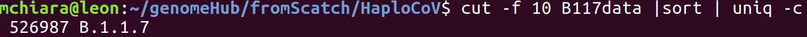
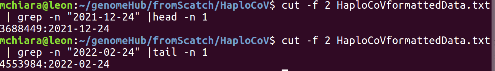

Subsetting data
===============

The input to HaploCoV consists in simple (yet relatively large) tables. The easiest way to execute custom analyses on a subset of data of interest is simply to subset the data accordingly.  On any unix system, this operation can be performed by using  built-in shell utilities. Like for example: `grep` or `head` or `tail`. 
A few examples are reported below.

**subset.pl**

If you are not familiar with the unix shell, you use take advantage of the *subset.pl* script included in the main repository, to subset data. The script accepts an input file in *HaploCoV format*, and extracts data that match user defined filters/criteria. When multiple criteria are provided, a logical **AND** is applied and only data that satisfy all the criteria/conditions specified by the user are extracted.

**options**
Subset.pl allows the application/definition of the following filters:

* *--Marea:* name of a macro geographic area as defined in *areaFile*;
* *--country:*  name of a country;
* *--region:* name of a region;
* *--lineage:* name of a lineage. Must match exactly. Only one can be specified;
* *--startD:* start-date in <YYYY-MM-DD> format. Only genomes collected after this date will be extracted;
* *--endD:* end-date in <YYYY-MM-DD> format. Only genomes collected before this date will be extracted.

Mandatory parameters are *--infile* and *--outfile*. At least one of  *--area*, *--country*, *--filter*,
*--lineage*, *--startD* or *--endD* should be set. If no filters are specified, execution will halt.

**Execution** 

A typical run of subset.pl should look something like:

::

 perl subset.pl --infile HaploCoV_formattedMetadata --country Thailand --startD 2022-05-01 --outfile Thai_HaploCoV_formattedMetadata
 

The output file *Thai_HaploCoV_formattedMetadata* will include only genomes collected in Thailand starting from 2022-05-01. 

.. warning::
Please be aware that *subset.pl* can only perform exact matching of the values/strings to be used for filtering your data. Hence if some values, names or parameters are mispelled the program will likely return an empty output. Please check carefully your input parameters, if the output of the *subser.pl* is not exactly what you were expecting. 

 
Geographically restricted analyses: how to analyse a specific Area, Country or region of interest
=================================================================================================

.. warning::
HaploCoV does not perform any check on the accuracy and consistency of geographic data and metadata associated with viral genome sequences/isolates included in metadata tables. Metadata are derived *-as they are-* from their respective repositories. If you encounter any inconsistencies or errors in the naming of continents, countries or regions please contact data submitters and/or curators of the database from which data were obtained.

**Basic statistics: how to summarize geographic data**

**Unix shell**

Simple stats on the number of genomes associated with distinct Continents, Countries, Regions and or Macro-geographic regions can be obtained by combining the ``cut`` , ``sort`` and ``uniq`` unix commands. 
These data are stored in columns 6 to 9 of your HaploCoV-formatted metadata file.

To obtain basic stats about any of such columns (in unix) you can:

1. extract the desired column with ``cut``;
2. sort all the values in the column you selected by using the ``sort`` utility;
3. summarize the results with ``uniq -c``.

For example you get a complete list of the countries in the metadata table as well as the total number of genome from every country by "piping" these 3 commands

::

 cut -f 8 HaploCoVformattedData.txt | sort | uniq -c

The output should look something like this:

and should provide a complete list of the countries that are listed in column 8 (as well as the total number of genomes associated with that country). At this point selection of one (or more) countries of interest can be performed  by:

1. finding the name/s of the country/countries in the list;
2. using ``grep``.

For example this command will extract data from Venezuela:

::

 grep -P "\tVenezuela\t" HaploCoVformattedData.txt >> dataFomMyCountriesOfInterest
 
The same approach can be applied likewise to any geographic level metadata/column to extract data from specific areas/locales. Feel free to read the manuals of the ``sort``, ``uniq``, ``cut`` and ``grep`` to find out all the options and set out the "pipeline" that is best suited for your needs. 

**subset.pl**
 
 you can use subset.pl to perform the same selection explained above:

::
 
 perl subset.pl --infile HaploCoV_formattedMetadata --country Venezuela --outfile VenezuelaMetadata
 
subset.pl supports subsetting/selection by macroArea (--Marea), country (--country), and region (--region), which correspond to columns 7,8 and 9 in the HaploCoV metadata file.

Select a specific lineage/HG
==============================

**unix shell**
To extract data of a specific lineage/HG all you need to know is the exact name of the lineage of interest. The ``grep`` command can be used to extract/select only lines that match that specific name from your HaploCoV formatted file. The only (minor) caveat is that Pango lineage names contain the "." symbol. In regular expressions the "." symbol is a meta-character that matches any single character. Hence it needs to be "escaped". I.e. we need to tell``grep`` that we want to match the actual "." character and not the metacharacter. This is done by prepending a "\\" symbol to "." in the regular expression to be passed to ``grep``.
For example if you are interested in ``B.1.1.7`` only you can subset your data like this:

::

 grep -P "\tB\.1\.1\.7\t"  HaploCoVformattedData.txt > B117data

The "\\t" symbol indicates a tabulation. It is used here since we want to make sure that the "word" *B.1.1.7* is the complete and full content of a column in our metadata file, otherwise we risk that other lineages containing the word *B.1.1.7* as a substring could be matched as well.
The method described in **#1 :  Basic statistics: how do I summarize geographic data?** can be adapted and reapplied here to double check that our output file only includes genomes assigned to the lineage of interest. We just need to extract a different column: (number 10) in this case:

::

 cut -f 10 B117data |sort | uniq -c

The output should be:

**subset.pl**
If you are not familiar with ``grep`` **subset.pl**  can be used to perform the selection of a lineage of interest. An example command is reported below.

::
 
 perl subset.pl --infile HaploCoV_formattedMetadata --lineage B.1.1.7 --outfile B117data
 
Please notice that only a single lineage can be specified at a time. 

Select by time
==============

**unix shell**
If you want to analyse only genomes/isolates collected between any interval of time, you can subset a table in *HaploCoV format* accordingly. 
Suppose for example that we want to analyse only sequences collected between 2021-12-24 and 2022-02-24, you will need to extract a "slice"  of the file containing data collected within the dates of interest. Since files in *HaploCoV format* are sorted by collection date, in descending order, all we need to do is to find the first line corresponding with the start date, and the last line corresponding with the end date. Subsetting can then be performed with the ``head`` and ``tail`` utilities.
Collection dates in HaploCoV formatted  metadata files are reported in the second column. We can find the first occurrence of any date of interest by applying grep to that column.
For example like this:

::

 cut -f 2 HaploCoVformattedData.txt | grep -n "2021-12-24" |head -n 1

Similarly we can find the last occurrence of the end date with:

::

 cut -f 2 HaploCoVformattedData.txt | grep -n "2022-02-24" |tail -n 1

Here ``cut`` is used to extract the column of interest (the second column in this case). ``grep`` with the -n option reports every occurrence of the date/dates of interest, and also the line number where the occurrence was found (-n). For the start date we use ``head -n 1`` since we are only interested in the first occurrence of that date. On the other hand for the end date we use ``tail -n 1`` since in this case we need the last occurrence.
In the example results look something like:

Hence lines, in between line 3688449 and line 4553984 hold all the data from the interval of time we want to analyse.
To extract those lines we can simply combine the `head` and `tail` commands. We need a total of 4553984-3688449+1=**865536** lines.

::

 head -n 4553984 HaploCoVformattedData.txt | tail -n 865536 > myIntervalOfTime

We use ``head`` to extract the first 4553984 lines in the file, which contain all the data up to 2022-02-24 (our end-date). Subsequently we use `tail` to grab only the 865536 lines that correspond with the offset between our start and end date.

**subset.pl**
The procedure described above requires some confidence with the unix shell, if you prefer a more streamlined solution you can (again) use **subset.pl**. The equivalent command should be something like:

::
 
 perl subset.pl --infile HaploCoV_formattedMetadata --startD 2021-12-24 --endD 2022-02-24 --outfile myIntervalOfTime

Can I combine all of the above?
===============================

**unix shell**
Yes, of course. Suppose that you want to analyse:

Interval of time -> 2021-12-24 to 2022-02-24
Lineage -> BA.1.1
Country -> USA

First you will need to extract the data for your time interval of interest with:

::

 cut -f 2 HaploCoVformattedData.txt | grep -n "2021-12-24" |head -n 1 # Find the first occurrence of the end date

::

 cut -f 2 HaploCoVformattedData.txt | grep -n "2022-02-24" |tail -n 1 # Find the last occurrence of the start date

::

`head -n 4553984 HaploCoVformattedData.txt | tail -n 865536 > myIntervalOfTime` #Extract the data, see above

After that you can subset by lineage:

::

 grep -P "\tBA\.1\.1\t" myIntervalOfTime > myIntervalOfTime_BA11data

And finally by country

::

 grep -P "USA" myIntervalOfTime_BA11data > myIntervalOfTime_BA11data_USA

Or again if you prefer a more compact alternative, you can use subset.pl :

::

**subset.pl**
 perl subset.pl --infile HaploCoV_formattedMetadata --startD 2021-12-24 --endD 2022-02-24 --lineage BA.1.1 --country USA --outfile myIntervalOfTime_BA11data_USA.
